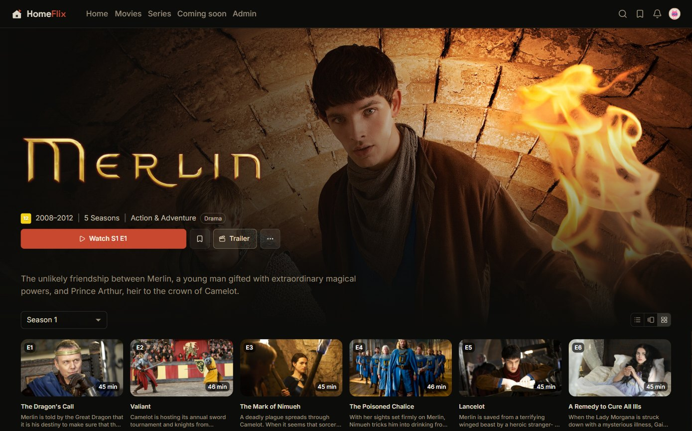
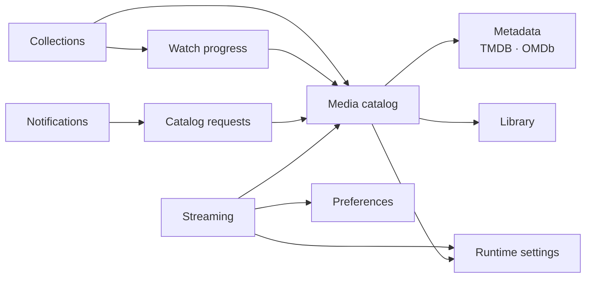

# 🎬 HomeFlix

[](https://github.com/lucaschf/homeflix/actions/workflows/ci.yml)
[](https://lucaschf.github.io/homeflix/)
[](https://www.python.org/downloads/)
[](https://github.com/astral-sh/ruff)

Self-hosted streaming server for a household: scans movies and series from local disks, enriches them from TMDB, and streams them over HLS to per-profile clients.

It is also a **lab for Clean Architecture and DDD** — when the two goals conflict, the architecture wins. Every significant decision is recorded as an [ADR](docs/adr/).



<sub>Web client: [homeflix-web](https://github.com/lucaschf/homeflix-web) — more screenshots there.</sub>

## What it does

- **Catalog** — filesystem scanner, TMDB/OMDb enrichment, provider artwork mirrored to local storage ([ADR-029](docs/adr/ADR-029-artwork-mirroring-storage.md)), full-text search (FTS5)
- **Streaming** — HLS with multi-audio and multi-subtitle tracks, hardware transcoding ([ADR-019](docs/adr/ADR-019-hardware-accelerated-transcoding.md)), OCR for image-based subtitles ([ADR-027](docs/adr/ADR-027-ocr-image-based-subtitles.md))
- **Intros and credits** — pluggable detectors (audio fingerprint or video frame-hash, [ADR-020](docs/adr/ADR-020-pluggable-intro-detector-frame-hash.md); visual credits detection, [ADR-021](docs/adr/ADR-021-credits-detector-per-file-visual.md)) feeding skip-intro and next-episode
- **Household** — profiles with library ACLs and an age-rating gate enforced server-side ([ADR-035](docs/adr/ADR-035-per-profile-maturity-gate.md)); progress, watchlists and playback preferences scoped per profile
- **Operations** — scheduled scan/enrichment jobs, duplicate detection and merge queue ([ADR-015](docs/adr/ADR-015-scanner-deduplication-by-content-identity.md)), runtime settings stored in the database ([ADR-013](docs/adr/ADR-013-runtime-settings-db-backed.md))

## Architecture

A **modular monolith**: one deployable, eleven bounded contexts under `src/modules/`, organized by business capability first and technical layer second (Screaming Architecture, [ADR-008](docs/adr/ADR-008-screaming-architecture.md)).

### Context map

Who reads from whom (consumer → provider). Reads go through a port owned by the consumer and an adapter in its `infrastructure/acl/` ([ADR-009](docs/adr/ADR-009-cross-bc-read-ports.md)), so the consumer never sees the provider's entities.



Not drawn: every context authenticates through Identity's published presentation contract ([ADR-024](docs/adr/ADR-024-published-presentation-contracts-cross-bc.md)), and Media also reads back from Streaming, Library, Watch progress and Catalog requests to compose catalog views.

Reactions across contexts travel as in-process domain events instead:

| Event | Published by | Handled by | Effect |
|-------|--------------|------------|--------|
| `MediaEnriched` | Media catalog | Catalog requests | Fulfils a pending request and notifies its subscribers |
| `MovieMerged` | Media catalog | Watch progress, Collections | Drops the merged-away title's progress; lists point to the survivor |
| `MoviePromotedToSeries` | Media catalog | Watch progress, Collections | Drops stale positions, rewrites list references |
| `UserDeleted` | Identity | Watch progress, Collections | Removes the user's progress and lists |

### Inside a context

```
modules/<context>/
├── domain/          # aggregates, value objects, repository interfaces, events
├── application/     # use cases, DTOs, ports, unit of work, event handlers
├── infrastructure/  # persistence, ACL adapters, external integrations
└── presentation/    # FastAPI routes, schemas, error mapping
```

```
modules → shared_kernel → building_blocks
presentation → application → domain ← infrastructure
```

### Decisions worth reading

| ADR | Decision |
|-----|----------|
| [ADR-007](docs/adr/ADR-007-immutable-entities-with-convention.md) | Immutable entities; changes return new instances via `with_*` |
| [ADR-009](docs/adr/ADR-009-cross-bc-read-ports.md) | Cross-context reads through consumer-owned ports and ACL adapters |
| [ADR-012](docs/adr/ADR-012-decentralized-error-http-mapping.md) | Each context maps its own domain errors to HTTP |
| [ADR-018](docs/adr/ADR-018-domain-identifiers-as-vos-at-boundaries.md) | Identifiers stay value objects across boundaries |
| [ADR-020](docs/adr/ADR-020-pluggable-intro-detector-frame-hash.md) | Moving the intro detector port to the right level of abstraction |
| [ADR-032](docs/adr/ADR-032-decompose-media-into-subdomains.md) | Decomposing the Media context into subdomains |

All 38 are indexed in [docs/adr](docs/adr/README.md).

### Guardrails

Context boundaries are enforced by [import-linter](https://import-linter.readthedocs.io/) ([ADR-037](docs/adr/ADR-037-import-linter-boundary-contracts.md)): modules are independent except through ACL adapters and published contracts, and layers only import downward. Architecture rules that a linter cannot see are pinned by tests in [`tests/architecture/`](tests/architecture/): every route must declare an authentication guard, admin checks have a single source, and cross-context catalog reads must pass an explicit viewing policy. CI also runs ruff, mypy in strict mode, a domain-exception semantics check ([ADR-028](docs/adr/ADR-028-domain-exception-semantics.md)) and a strict docs build.

## By the numbers

- 11 bounded contexts · 150+ REST endpoints · 4,400+ tests
- Backend: Python 3.12, FastAPI, SQLAlchemy 2, Pydantic v2, SQLite (dev) / PostgreSQL (prod), FFmpeg
- Frontend: React, TypeScript, TanStack Query, MUI, hls.js ([homeflix-web](https://github.com/lucaschf/homeflix-web))

## Quick start

Requires Python 3.12+, [Poetry](https://python-poetry.org/docs/#installation) and FFmpeg.

```bash
git clone https://github.com/lucaschf/homeflix.git && cd homeflix
make setup          # dependencies + pre-commit hooks
cp .env.example .env
make migrate
make dev            # http://localhost:8005 — API docs at /docs
```

Key settings in `.env`: `DATABASE_URL`, `MEDIA_DIRECTORIES` (comma-separated), `TMDB_API_KEY`, optional `OMDB_API_KEY`.

`make help` lists the remaining targets (tests, lint, typecheck, migrations, docs). Branches start from `develop`; commits follow [Conventional Commits](https://www.conventionalcommits.org/) with the module as scope, e.g. `feat(media): …`.

## Documentation

Published at **[lucaschf.github.io/homeflix](https://lucaschf.github.io/homeflix/)**:

- [Requirements](docs/homeflix-requirements.md) — feature specifications
- [Roadmap](docs/roadmap.md) — what ships next and why
- [ADRs](docs/adr/) — architecture decision records
- [Standards](docs/standards/) — API response format, exceptions, logging, testing

## License

MIT — see [LICENSE](LICENSE).
